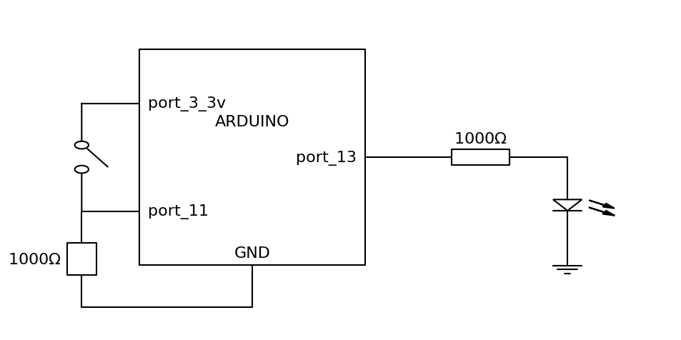

# 开关

开关也算是最基本的'传感器'了,没啥好说的,这个项目是监控开关,从而控制灯的亮灭.

## 器材

1. led小灯
2. 开关
3. 面包板
4. 1000欧姆稳压电阻

## 电路图



## 程序

本程序使用数字输入输出端口的11号口和13号口11号口用来读取信号13号用来控制灯的亮灭,程序如下:

```C++
auto LED=13;
auto SW=11;

void setup() {
    // put your setup code here, to run once:
    pinMode(LED,OUTPUT);
    pinMode(SW,HIGH);
}

void loop() {
    // put your main code here, to run repeatedly:
    auto val=digitalRead(SW);
    if(val){
        digitalWrite(LED,HIGH);
    }else{
        digitalWrite(LED,LOW);
    }
}
```
